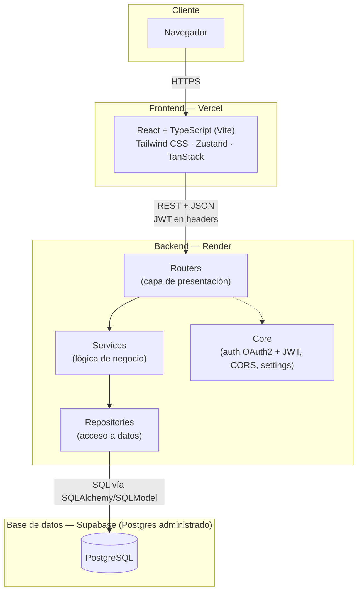

# Arquitectura — P0

## Diagrama de arquitectura

## Componentes

| Componente | Responsabilidad | Detalle |
|---|---|---|
| Frontend (React) | UI y estado de cliente | Consume la API REST del backend, ver [`frontend/README.md`](../../frontend/README.md) |
| Backend (FastAPI) | Lógica de negocio y acceso a datos, organizado en N-capas | Ver [`backend/README.md`](../../backend/README.md) |
| Base de datos (PostgreSQL) | Persistencia única del sistema | Esquema en [`Esquema-Base-Datos.md`](Esquema-Base-Datos.md) y [`database/postgresql/schema.sql`](../../database/postgresql/schema.sql) |

## Flujo de una petición

1. El navegador carga la SPA de React servida desde Vercel.
2. React llama a la API REST del backend (Render) por HTTPS, adjuntando el JWT emitido en el login.
3. El router valida la petición y delega en el service correspondiente.
4. El service aplica la lógica de negocio (por ejemplo, la máquina de estados de una orden) y llama al repository.
5. El repository ejecuta la consulta contra PostgreSQL (Supabase) vía SQLAlchemy/SQLModel.
6. La respuesta viaja de vuelta por las mismas capas hasta el cliente.

## Fuera de esta instancia

No hay despliegue real todavía: Vercel, Render y Supabase son las plataformas elegidas para la Entrega Final. En esta entrega (2.ª) solo se define la arquitectura; el código se implementa después de la validación del tutor.
