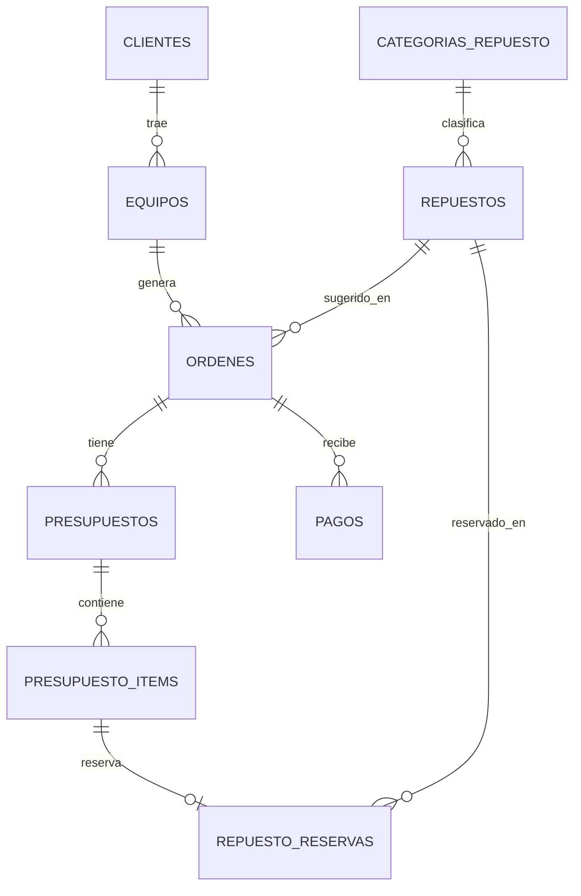

# Esquema de base de datos — P0

Motor: PostgreSQL. Script completo en `database/postgresql/schema.sql`.

## Diagrama entidad-relación

## Tablas y propósito

| Tabla | Propósito |
|---|---|
| `clientes` | Datos de contacto de quien trae el equipo. |
| `equipos` | Dispositivo que ingresa (tipo genérico, modelo, IMEI, estado físico de ingreso). |
| `ordenes` | Una orden de trabajo por ingreso de equipo. Lleva estado técnico y estado de pago. |
| `presupuestos` | Versiones de presupuesto de una orden (v1, v2, v3…). |
| `presupuesto_items` | Ítems dentro de un presupuesto, cada uno con su propio estado de aprobación. |
| `categorias_repuesto` / `repuestos` | Catálogo de repuestos y stock total disponible. |
| `repuesto_reservas` | Vínculo entre un ítem de presupuesto y el repuesto que reserva o utiliza. |
| `pagos` | Pagos registrados contra una orden (permite pagos parciales el mismo día). |

## Trazabilidad regla de negocio → diseño

Reglas según `entrega-2/Caso-Completo-Reparacion.md`, sección 4.

1. **Un presupuesto rechazado o reemplazado nunca se borra.** → `presupuestos` es versionado (`version`, `UNIQUE (orden_id, version)`); no hay operación de borrado ni de sobreescritura de versiones anteriores.
2. **Un repuesto se reserva al presupuestar y se descuenta de stock solo cuando el técnico confirma su uso.** → `repuesto_reservas.estado` distingue `reservado` de `utilizado`; `repuestos.stock_total` se decrementa por aplicación, no automáticamente al crear la reserva.
3. **Una falla nueva no bloquea los ítems ya aprobados de la misma orden.** → `presupuesto_items.estado` es independiente por ítem (no hay un único estado de aprobación a nivel de presupuesto completo), permitiendo aprobar unos y rechazar otros dentro de la misma orden.
4. **Estado técnico y estado de pago son campos separados.** → `ordenes.estado` (enum `estado_orden`) y `ordenes.estado_pago` (enum `estado_pago`) son dos columnas independientes; no existe un estado combinado tipo "entregado/cobrado".
5. **No se almacena PIN/contraseña del equipo.** → No hay columna para ese dato en `equipos` ni en ninguna otra tabla.
6. **Equipo `Listo` sin retirar pasa a alerta a los 30 días, con segundo aviso documentado.** → `ordenes.fecha_listo`, `fecha_primer_aviso_no_retirado` y `fecha_segundo_aviso_no_retirado` permiten calcular y dejar constancia del vencimiento sin una tabla aparte.
7. **No se habla de "rentabilidad neta", solo margen por reparación.** → No es una restricción de esquema; se resuelve en la capa de reportes, calculando `SUM(pagos.monto) - repuestos_utilizados - mano_obra` por orden, sin ninguna columna ni vista llamada "rentabilidad neta".

## Fuera de este esquema

Cuenta corriente, proveedores/compras, roles de usuario y métricas/IA no se modelan en el P0 (ver `entrega-2/Modulos-P0.md`).
